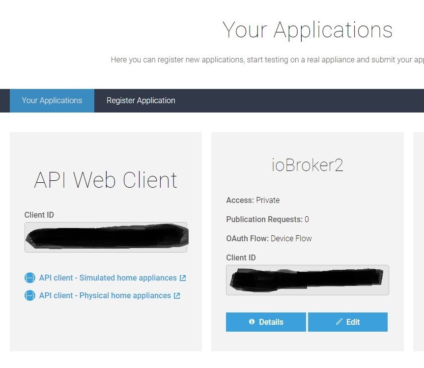

# ioBroker.homeconnect
=================

## Voraussetzungen vor der Installation

Es muß mindestens Node.js Version 6 installiert sein!!

Für den Adapter wird eine ClientID benötigt. Dazu muss man sich ersteinmal im Developer-Portal von Home-Connect registrieren.

## Requirements before installation

At least Node.js version 6 must be installed!

A ClientID is required for the adapter. You have to register first in the developer portal of Home-Connect.

https://developer.home-connect.com

Bei **Default Home Connect User Account for Testing** die E-Mail-Adresse angeben, mit der die Home-Connect-App
registriert wurde, diese wird später auch beim Authorization-Prozess benötigt.

For **Default Home Connect User Account for Testing**, specify the e-mail address with which the Home Connect app is to be sent.
was registered, this is also required later in the authorization process.

Bei **Account Type** Individual auswählen. Die restlichen Daten sofern vorhanden ergänzen (keine Ahnung, ob das geprüft wird).

For **Account Type** select Individual. Add the remaining data if available (no idea if this will be checked).

Dann auf **Applications** und anschließend auf **Register Application** gehen.

Then go to **Applications** and then to **Register Application**.

Bei **Application ID** einen Namen für die Application eintragen, z.B. ioBroker. Bei **OAuth Flow** Device Flow selektieren das 
letzte Feld kann leer bleiben. Dann Speichern und dann hat man die benötigte ClientID.

For **Application ID** enter a name for the application, e.g. ioBroker. With **OAuth Flow** Device Flow select the 
The last field can remain empty. Then save and you have the required ClientID.

##  Konfiguration

In der Adapter-Config muss nur die ClientID eingetragen werden. Wenn der Adapter läuft, wird eine Authorization-URL generiert, diese wird im 
Log angezeigt. Die URL einfach kopieren und im Browser öffnen. Dann die Logindaten vom Home-Connect-Account (nicht vom Developer-Account) eingeben und bestätigen. Dann die Authorisierung bestätigen. Fertig.

## Configuration

Only the ClientID must be entered in the adapter configuration. If the adapter is running, an authorization URL is generated; this is specified in the 
Log is displayed. Simply copy the URL and open it in your browser. Then enter the login data from the Home Connect account (not from the Developer account) and confirm. Then confirm the authorization. Done.

## Changelog

### 0.0.5  (28.11.2018)

* (dna909) add eventstream handling

### 0.0.4  (23.11.2018)

* (dna909) add event-listener

### 0.0.3  (14.11.2018)

* (dna909) query States and available programs

### 0.0.2  (08.11.2018)

* (dna909) OAuth2 Deviceflow-Authorization, enumerate connected appliances

### 0.0.1  (09.10.2018)

* (dna909) initial release

## License
The MIT License (MIT)

Copyright (c) 2018 dna909 <dna909@googlemail.com>

Permission is hereby granted, free of charge, to any person obtaining a copy
of this software and associated documentation files (the "Software"), to deal
in the Software without restriction, including without limitation the rights
to use, copy, modify, merge, publish, distribute, sublicense, and/or sell
copies of the Software, and to permit persons to whom the Software is
furnished to do so, subject to the following conditions:

The above copyright notice and this permission notice shall be included in
all copies or substantial portions of the Software.

THE SOFTWARE IS PROVIDED "AS IS", WITHOUT WARRANTY OF ANY KIND, EXPRESS OR
IMPLIED, INCLUDING BUT NOT LIMITED TO THE WARRANTIES OF MERCHANTABILITY,
FITNESS FOR A PARTICULAR PURPOSE AND NONINFRINGEMENT. IN NO EVENT SHALL THE
AUTHORS OR COPYRIGHT HOLDERS BE LIABLE FOR ANY CLAIM, DAMAGES OR OTHER
LIABILITY, WHETHER IN AN ACTION OF CONTRACT, TORT OR OTHERWISE, ARISING FROM,
OUT OF OR IN CONNECTION WITH THE SOFTWARE OR THE USE OR OTHER DEALINGS IN
THE SOFTWARE.
